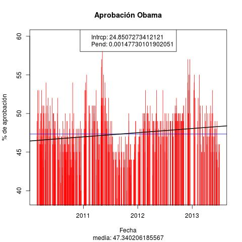
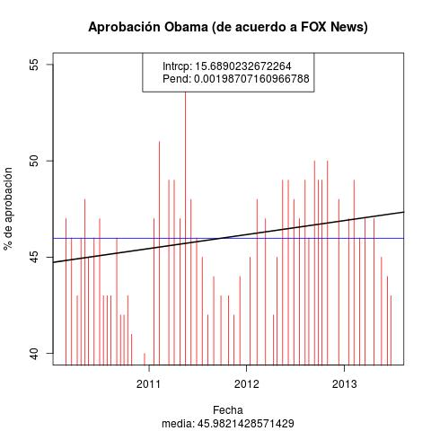
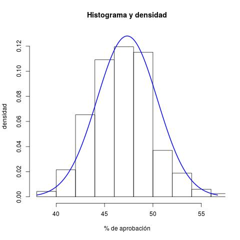

# INTRODUCCIÓN
El presente repositorio contiene la descripción del proyecto final del  
curso "Taller de Programación".

# Datos
Los datos para el proyecto se encuentran en el archivo de texto  
"AcptObama.txt", que contiene el registro de los niveles de aceptación  
del presidente de los Estados Unidos (Obama), a lo largo del tiempo  
en su propia nación. Una vez que se ha leído mediante alguna de las  
funciones apropiadas del lenguaje R, los datos se ven como una tabla  
(data frame), de cinco columnas, a saber:

1. **org**. Identificación de la organización encuestadora.
2. **year**. Año en que se hizo la observación (encuesta).
3. **approve**. Nivel de aprobación, en porcentaje.
4. **disapprove**. Nivel de desaprobación, en porcentaje.
5. **date**. Fecha de la observación (encuesta), en formato: yyyy-mm-dd.

El conjunto de datos consta de al rededor de 500 registros (renglones),  
cuyas fechas **no están ordenadas**. 

# 1. Serie de tiempo de todos los datos
## 1.1. Gráfico de la serie de tiempo
Hacer un programa en R que muestre gráficamente la evolución del grado  
de aprobación de su nación a lo largo del tiempo, como un gráfico de  
agujas (tipo "h"). La apariencia resultante debe ser como los gráficos de  
aguja que se muestran en la Fig. 1, en color rojo.

## 1.2. Media de aprobación
Calcular la media del nivel de aprobación y graficar ese valor como una  
línea horizontal en el gráfico de serie de tiempo elaborado previamente.  
El resultado se muestra como una línea horizontal azul en la Fig. 1.

Además incluir como un subtítulo en la gráfica el valor de la media, tal  
como se muestra también en la Fig. 1.

## 1.3. Modelo lineal
Hacer un modelo lineal, que relacione las fechas con los niveles de   aprobación. Graficar, en negro, la línea recta resultante, y escribir  
en una leyenda los valores de la pendiente y la intersección de dicha  
recta.

**Figura 1.** Evolución de la aprobación a Obama a lo largo del tiempo.

# 2. Un subconjunto de los datos
Las distintas casas u organizaciones encuestadoras realizaron distintos  
muestreos a lo largo del tiempo. La que mayor número de muestreos hizo  
fue la llamada **"FOX News"**. Hacer, **mediante un programa de R** un  gráfico  
semejante al de todo el conjunto de datos, elaborado en la sección 1,  
pero que ahora considere solamente los datos correspondientes a la  
organización encuestadora "FOX News". El resultado debe ser semejante al que  
se muestra en la Fig. 2.

**Figura 2.** Evolución aprobación a Obama, según FOX News, a lo largo del tiempo.

# 3. Valores extremos
Programar en R para que identifique los renglones correspondientes a los valores  
mínimo y máximo del nivel de aprobación, y que con base en eso imprima la fecha  
y la organización encuestadora correspondiente al valor mínimo y al valor máximo  
de aprobación.

# 4. Histograma y función de densidad
Hacer el histograma y la función de densidad de probabilidades **normal**, que  
se ajusta a la totalidad de los datos. El resultado debe ser semejante al que  
se muestra en la Fig. 3.

**Figura 3.** Histograma y curva de densidad normal de probabilidad ajustada.

